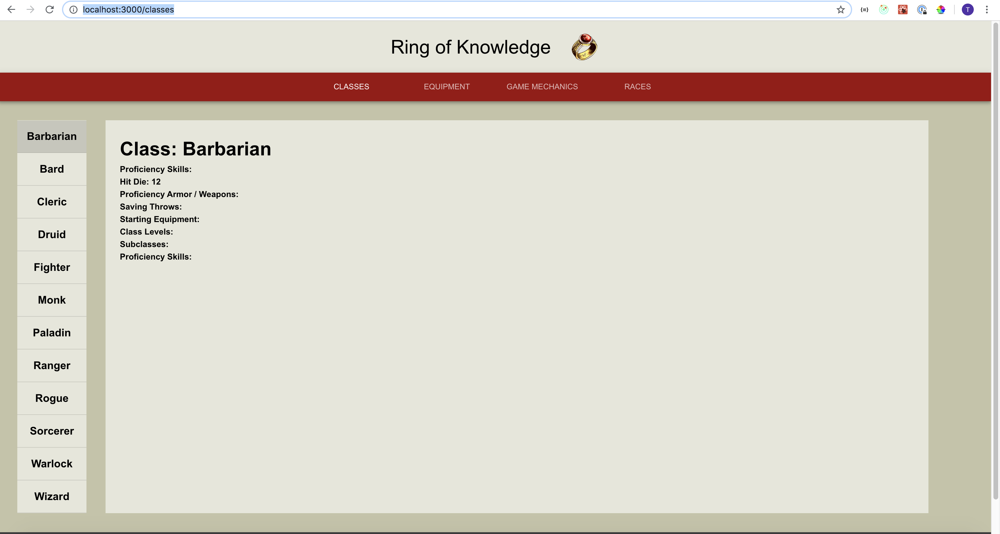

# DnDHelper
Simple App that can give you data on dnd. Very helpful for dms who dont want to search through a monster book or spells.

Goal of this project is to demonstrate skill and knowledge with React.js. 

## The way that I am scoping work is giving each a simple projection.
* Very Small - Less then half a day
* Small - Half to full day
* Medium - 2 / 3 days
* Large - 1 week
* Very Large - Needs to be broken down into smaller tasks. More or less ideas I have not scoped yet.

### RoadMap
- [x] Implement Resift * Small
- [x] Finish Footer * Very Small
- [] Show data for everything classes endpoint provides. * Small to Medium
- [] Show data for everything equipment endpoint provides. * Small to Medium
- [] Show data for everything game mechanics classes endpoint provides. * Small to Medium
- [] Show data for everything races classes endpoint provides. * Small to Medium
- [] Show data for everything spells classes endpoint provides. * Small to Medium
- [] Figure out how I want to deploy app and deploy it. * Small to Medium
- [] Implement character builder template.  * Large
- [] Message board. * Very Large
- [] Game to test out your created characters in specific scenarios. * Very Large

## 10/09/2019 Screenshot
